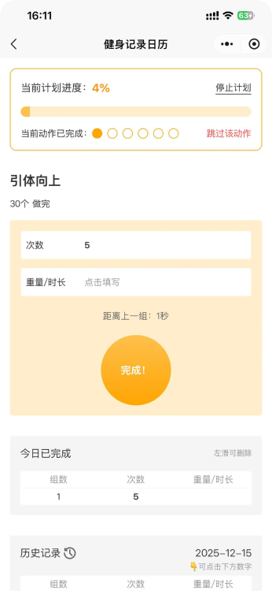
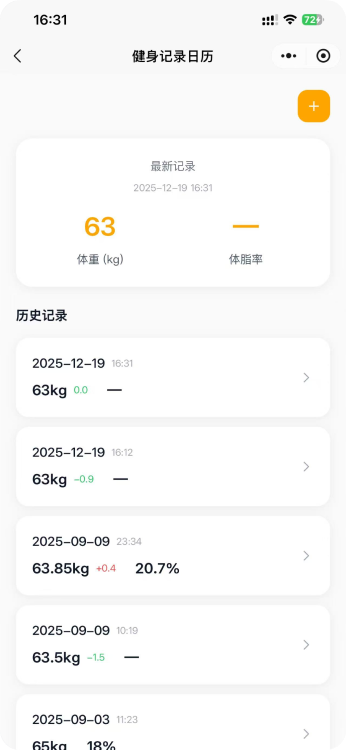
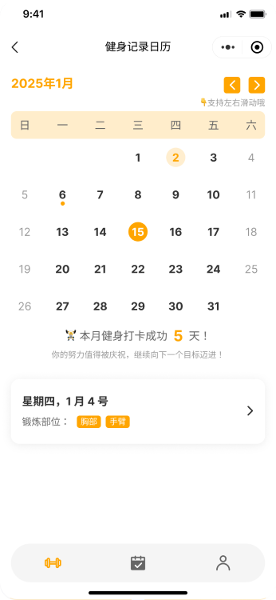
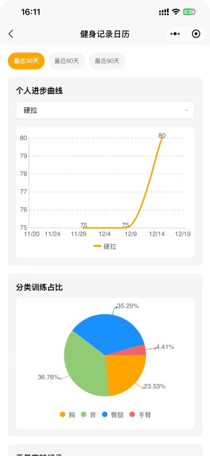
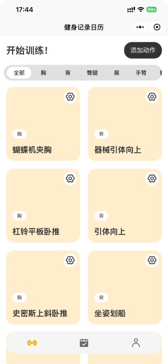

# 🏋️ Fitness Tracker Showcase

<div align="center">
  
  [](https://www.typescriptlang.org/)
  [](https://vuejs.org/)
  [](https://nestjs.com/)
  [](https://www.prisma.io/)

  

**A comprehensive fitness tracking application showcasing production-ready full-stack development**

</div>

---

## 🎯 Project Overview

This is a **production-quality showcase** extracted from my commercial fitness tracking application serving 7,000+ active users. Built to demonstrate enterprise-level full-stack development capabilities while protecting the commercial codebase.

### Why This Project Stands Out

- ✅ **Real Production Experience**: Based on battle-tested code from a live application
- ✅ **Modern Tech Stack**: Latest stable versions of Vue 3, NestJS, and Prisma
- ✅ **Full-Stack Expertise**: From database design to UI/UX implementation
- ✅ **Clean Architecture**: Modular, maintainable, and scalable patterns
- ✅ **Type Safety**: TypeScript everywhere with strict mode enabled

---

## ✨ Key Features

### 🔐 Authentication & Security

- JWT-based authentication with Passport.js
- Password hashing with bcrypt
- Protected routes and role-based access
- XSS protection and input validation

### 💪 Workout Management

- Exercise library with categorization
- Custom exercise creation
- Training history tracking
- Progress visualization with charts

### 📋 Training Plans

- Create structured workout plans
- Exercise grouping and scheduling
- Plan templates and customization
- Progress tracking per plan

### 📊 Body Metrics

- Weight and body fat tracking
- Historical data visualization
- Trend analysis with ECharts
- Monthly/yearly reports

### 📅 Training Calendar

- Daily workout logging
- Notes and observations
- Streak tracking
- Monthly summaries

---

## 🛠️ Tech Stack

### Backend

- **Framework**: [NestJS 9.0](https://nestjs.com/) - Progressive Node.js framework
- **Language**: TypeScript 5.0+ with strict mode
- **Database**: PostgreSQL with [Prisma 5.16](https://www.prisma.io/) ORM
- **Authentication**:
  - JWT tokens with [Passport.js](https://www.passportjs.org/)
  - [@nestjs/jwt](https://docs.nestjs.com/security/authentication) for token management
  - bcrypt for password hashing
- **API Documentation**: [Swagger/OpenAPI](https://swagger.io/) via `@nestjs/swagger`
- **Security**:
  - XSS protection with `xss` library
  - Rate limiting with `@nestjs/throttler` (30 requests/60s)
  - Input validation with `class-validator` and `class-transformer`
- **Caching**: In-memory caching with `@nestjs/cache-manager`
- **WeChat Integration**: `nest-wechat` for WeChat mini-program support
- **Testing**: Jest with supertest for E2E testing
- **Deployment**: Docker containerization with multi-stage builds

### Frontend

- **Framework**: [UniApp](https://uniapp.dcloud.net.cn/) - Cross-platform framework
- **UI Library**: Vue 3.4 with Composition API
- **Language**: TypeScript 5.4+ with strict type checking
- **State Management**: [Pinia 2.0](https://pinia.vuejs.org/) - Vue's official state management
- **Build Tool**: [Vite 5.2](https://vitejs.dev/) - Next-generation frontend tooling
- **Styling**:
  - [UnoCSS](https://unocss.dev/) - Atomic CSS engine
  - [wot-design-uni](https://github.com/Moonofweisheng/wot-design-uni) - Component library
- **Charts**: [uCharts](https://www.ucharts.cn/) - Cross-platform charting library
- **Code Quality**:
  - ESLint with `@uni-helper/eslint-config`
  - Prettier for code formatting
  - Git hooks with `simple-git-hooks` and `lint-staged`
- **Platforms Supported**:
  - WeChat Mini-Program (primary)
  - H5 (Web)
  - iOS/Android App
  - Alipay, Baidu, Toutiao mini-programs

---

## 🏗️ Architecture

### Project Structure

```
move-on/
├── move-on-api/          # Backend API (NestJS)
│   ├── src/
│   │   ├── auth/         # Authentication module
│   │   ├── users/         # User management
│   │   ├── exercises/     # Exercise library
│   │   ├── workouts/      # Workout tracking
│   │   ├── plans/         # Training plans
│   │   ├── body-records/  # Body metrics
│   │   ├── daily-notes/   # Calendar & notes
│   │   ├── feedback/      # User feedback
│   │   ├── report/        # Analytics & reports
│   │   └── prisma/        # Database service
│   └── prisma/
│       └── schema.prisma  # Database schema
│
└── move-on-uni/          # Frontend (UniApp)
    ├── src/
    │   ├── pages/         # Main pages
    │   ├── pages-sub/     # Sub-pages
    │   ├── components/    # Reusable components
    │   ├── stores/        # Pinia stores
    │   ├── api/           # API client
    │   ├── composables/   # Vue composables
    │   └── layouts/       # Page layouts
    └── manifest.json      # UniApp config
```

### Key Design Patterns

- **Modular Architecture**: Feature-based module organization in NestJS
- **Repository Pattern**: Prisma service abstraction for database operations
- **DTO Pattern**: Data Transfer Objects for request/response validation
- **Guard Pattern**: JWT authentication guards for route protection
- **Interceptor Pattern**: Response transformation and error handling
- **Composition API**: Vue 3 Composition API for better code organization

---

## 📚 Documentation

### API Documentation

When running the backend in development mode, Swagger documentation is automatically available at:

- **URL**: `http://localhost:3005/api`
- **Features**: Interactive API testing, request/response schemas, authentication testing

### Database Schema

The database schema is defined in `move-on-api/prisma/schema.prisma`. Key models include:

- **User**: User accounts and authentication
- **Exercise**: Exercise library with categories
- **Workout**: Individual workout sessions
- **Plan**: Training plans and schedules
- **BodyRecord**: Weight and body metrics tracking
- **DailyNote**: Calendar entries and notes

---

## 📱 Screenshots & Demo

Since this is a **WeChat Mini-Program** project, you can scan the QR code below to preview the application in WeChat:

<div align="center">

### 📲 Scan to Preview


_Scan with WeChat to open the mini-program_

</div>

### 🎬 Demo & Screenshots

<div align="center">

#### Main Features

|         Workout Tracking         |        Training Plans        |           Body Metrics           |
| :------------------------------: | :--------------------------: | :------------------------------: |
|  |  |  |

|           Calendar View            |            Statistics             |           Exercise Library           |
| :--------------------------------: | :-------------------------------: | :----------------------------------: |
|  |  |  |

</div>

---

## 🔒 Security Features

- **JWT Authentication**: Secure token-based authentication
- **Password Hashing**: bcrypt with salt rounds
- **XSS Protection**: Input sanitization
- **Rate Limiting**: Prevents API abuse (30 req/60s)
- **Input Validation**: DTO validation with class-validator
- **CORS Configuration**: Configurable cross-origin policies
- **SQL Injection Prevention**: Prisma ORM parameterized queries

---

## 📈 Performance Optimizations

- **Database Indexing**: Optimized queries with Prisma
- **Caching**: In-memory caching for frequently accessed data
- **Lazy Loading**: Code splitting in frontend
- **Image Optimization**: Optimized assets for mini-programs
- **Bundle Size**: Tree-shaking and code splitting with Vite

---

<div align="center">

**Built with ❤️ using Vue 3, NestJS, and Prisma**

[⬆ Back to Top](#-fitness-tracker---full-stack-demo)

</div>
